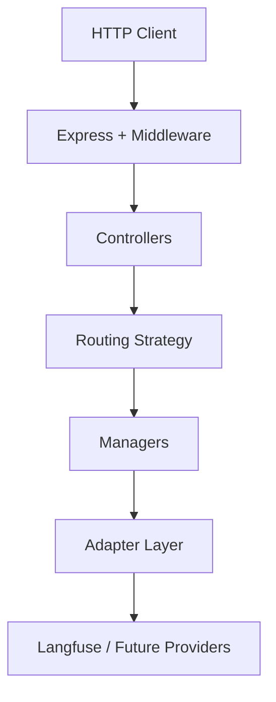
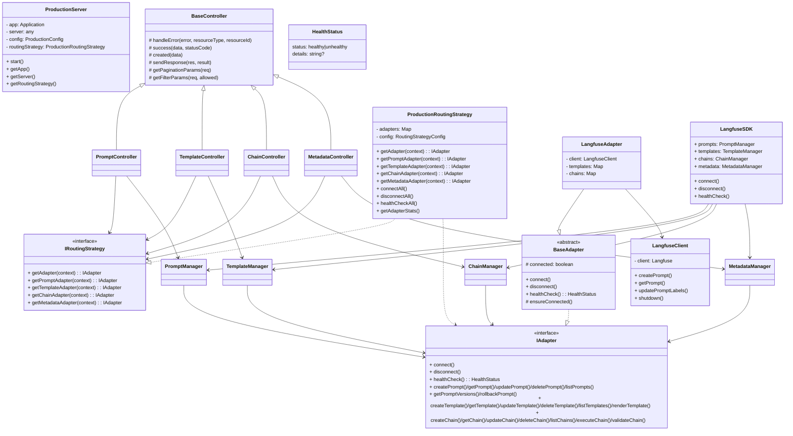
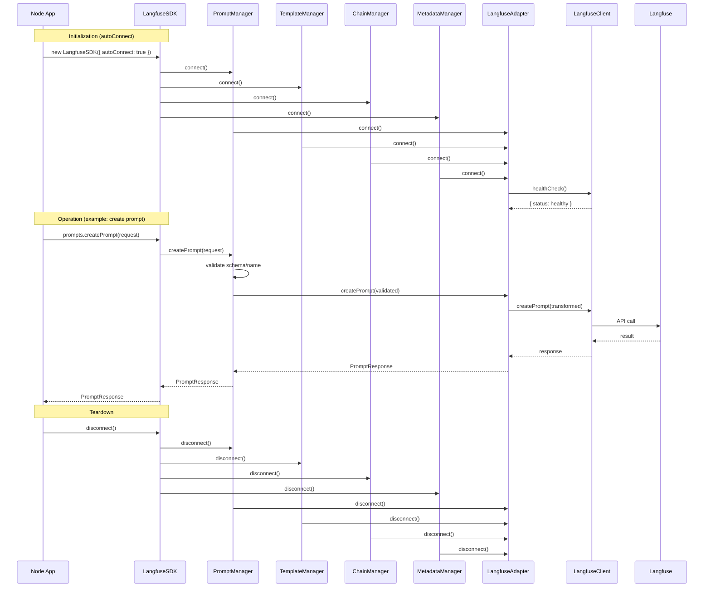

## Langfuse Adaptor Architecture Specification

### 1. Purpose and Scope

- **Purpose**: Define the reference architecture, module boundaries, class responsibilities, and public contracts of the Langfuse Adaptor. This document serves engineers building features, extending adapters, or integrating via SDK/REST.
- **Scope**: Runtime architecture, key classes/interfaces, request/response flows, non-functional requirements, and extensibility guidelines.

### 2. High-Level Overview

- **Pattern**: Controller Pattern with Routing Strategy and Adapter abstraction.
- **Layers**: HTTP API → Controllers → Routing Strategy → Managers (SDK) → Adapter(s) → External Service(s).

### 3. Architectural Drivers

- **Separation of concerns**: Controllers handle HTTP; managers handle business rules; adapters encapsulate provider specifics.
- **Extensibility**: Plug-and-play adapters; strategy-based routing; type-safe SDK.
- **Production readiness**: Logging, validation, error handling, health checks, graceful shutdown, CORS/Helmet, rate limiting.
- **Consistency**: Strong TypeScript types; unified request/response shapes; versioning utilities.

### 4. Component Model and Responsibilities

#### 4.1 Server and API Layer

- `src/api/server.ts` → `ProductionServer`
  - Responsibilities
    - Create and configure Express app and middleware
    - Initialize `ProductionRoutingStrategy`
    - Mount resource routes (`/prompts`, `/templates`, `/chains`, `/metadata`)
    - Provide `/health` and root metadata endpoints
    - Manage lifecycle: connect adapters, start/stop HTTP server, graceful shutdown, health monitoring
  - Key public methods
    - `start(): Promise<void>`
    - `getApp(): express.Application`
    - `getServer(): any`
    - `getRoutingStrategy(): ProductionRoutingStrategy`

#### 4.2 Controllers (HTTP)

- Base class: `src/api/controllers/base-controller.ts` → `BaseController`
  - Common utilities: `handleError`, `success`, `created`, `sendResponse`, `getPaginationParams`, `getFilterParams`

- Resource controllers
  - `PromptController`
    - Endpoints: create, get, getVersion, update, list, versions, rollback, delete, search, validate, health
    - Collaborators: `IRoutingStrategy`, `PromptManager`
  - `TemplateController`
    - Endpoints: create, get, update, list, render, delete, search, validate, versions, health
    - Collaborators: `IRoutingStrategy`, `TemplateManager`
  - `ChainController`
    - Endpoints: create, get, update, list, execute, delete, search, validate, versions, executions, health
    - Collaborators: `IRoutingStrategy`, `ChainManager`
  - `MetadataController`
    - Endpoints: stats, resources, search, activity, duplicates, orphaned, system, validation, global search, export, tag/author analytics, health
    - Collaborators: `IRoutingStrategy`, `MetadataManager`, `PromptManager`, `TemplateManager`, `ChainManager`

Controllers extract a `RoutingContext` from headers and delegate to the appropriate manager via the routing strategy.

#### 4.3 Routing Strategy

- `src/api/strategies/routing-strategy.ts`
  - Interfaces: `IRoutingStrategy`, `RoutingContext`, `RoutingStrategyConfig`
  - Implementation: `ProductionRoutingStrategy`
    - Manages adapter instances (Map)
    - Decides adapter per request (`getAdapter`, typed helpers)
    - Lifecycle: `connectAll`, `disconnectAll`
    - Health: `healthCheckAll`, `getAdapterStats`
  - Extensible to multiple providers (OpenAI/Anthropic/etc.) and context-aware routing

#### 4.4 SDK Managers (Business Logic)

- Location: `src/sdk/*`
- Purpose: Validate inputs, coordinate adapter calls, add business rules and utilities.
  - `PromptManager`
    - Methods: `connect`, `disconnect`, `healthCheck`, `createPrompt`, `getPrompt`, `getPromptVersion`, `updatePrompt`, `deletePrompt`, `listPrompts`, `getPromptVersions`, `rollbackPrompt`, `getLatestPrompt`, `comparePromptVersions`, `searchPrompts`, `validatePrompt`, `getPromptStats`
  - `TemplateManager`
    - Methods: `connect`, `disconnect`, `healthCheck`, `createTemplate`, `getTemplate`, `updateTemplate`, `deleteTemplate`, `listTemplates`, `renderTemplate`, `renderTemplateWithEngine`, `validateTemplate`, `previewTemplate`, `getTemplateVariables`, `searchTemplates`, `cloneTemplate`, `getTemplateStats`
  - `ChainManager`
    - Methods: `connect`, `disconnect`, `healthCheck`, `createChain`, `getChain`, `updateChain`, `deleteChain`, `listChains`, `executeChain`, `validateChain`, `getChainDependencies`, `cloneChain`, `getChainExecutionPlan`, `searchChains`
  - `MetadataManager`
    - Methods: `connect`, `disconnect`, `healthCheck`, `getOverallStats`, `getAllResourceMetadata`, `getResourcesByTag`, `getResourcesByAuthor`, `getTagAnalysis`, `getAllTagsAnalysis`, `getAuthorAnalysis`, `getAllAuthorsAnalysis`, `searchResources`, `getRecentActivity`, `getResourceDuplicates`, `getUnusedTags`, `getOrphanedResources`, `exportMetadata`
  - Unified entrypoint: `LangfuseSDK` exposes `prompts`, `templates`, `chains`, `metadata` and lifecycle methods `connect`, `disconnect`, `healthCheck`.

#### 4.5 Adapter Layer

- `src/adapters/base-adapter.ts`
  - Interfaces: `IPromptAdapter`, `ITemplateAdapter`, `IChainAdapter`, `IAdapter`
  - Abstract: `BaseAdapter` (enforces connection state; declares all operations)

- `src/adapters/langfuse/langfuse-adapter.ts` → `LangfuseAdapter`
  - Implements `IAdapter`; composes `LangfuseClient`
  - Prompt operations via Langfuse API
  - Template/Chain operations implemented in-memory for now
  - Adds helpers: variable extraction, substitution, versioning via semver

- `src/adapters/langfuse/langfuse-client.ts` → `LangfuseClient`
  - Thin client around `langfuse` SDK; provides `createPrompt`, `getPrompt`, `updatePrompt`, `updatePromptLabels`, `getPrompts` (simulated), `getPromptVersions` (simulated), `deletePrompt` (soft-delete via inactive version), `healthCheck`, `shutdown`

#### 4.6 Types and Data Contracts

- Location: `src/types/*`
  - `prompt.ts`: `CreatePromptRequest`, `UpdatePromptRequest`, `PromptResponse`, `PromptListOptions`, `RollbackRequest`
  - `template.ts`: `CreateTemplateRequest`, `UpdateTemplateRequest`, `TemplateResponse`, `TemplateListOptions`, `TemplateRenderRequest`, `TemplateRenderResponse`
  - `chain.ts`: `ChainStep`, `CreateChainRequest`, `UpdateChainRequest`, `ChainResponse`, `ChainExecutionRequest`, `ChainExecutionResult`
  - `common.ts`: `BaseMetadata`, `PaginationOptions`, `FilterOptions`, `ApiResponse<T>`, `ExecutionOrder`, `DataMappingConfig`

#### 4.7 Middleware

- `src/api/middleware/error-handler.ts`
  - Errors: `HttpError`, `ValidationError`, `NotFoundError`, `ConflictError`, `UnauthorizedError`, `ForbiddenError`, `BadRequestError`, `InternalServerError`
  - Middleware: `errorHandler`, `notFoundHandler`, and global process handlers
  - Helpers: `createErrorResponse`, `createSuccessResponse`, `isOperationalError`, `logError`, `handleGracefulShutdown`

- `src/api/middleware/validation.ts`
  - General validator: `validate({ body, params, query, headers })`
  - Common schemas: `commonSchemas`
  - Utilities: `validateId`, `validateIdAndVersion`, `validatePagination`, `requireJsonContent`, `validateRequestSize`, and simple in-memory `rateLimit`

#### 4.8 Routes

- `src/api/routes/*-routes.ts` registers each resource’s endpoints, wires validation, and dispatches to controllers via `asyncHandler`.
  - Prompts: CRUD, versions, rollback, search, validate, health
  - Templates: CRUD, list, render, search, validate, versions, health
  - Chains: CRUD, list, execute, search, validate, versions, executions, health
  - Metadata: stats, resources, search, activity, duplicates, orphaned, system, validation, global search, export, tag/author analytics, health

#### 4.9 Configuration and Logging

- `src/config/production.ts`
  - `ProductionConfig`: server, langfuse, logging, monitoring, security, database
  - `createProductionConfig()`, `validateProductionConfig()`, `getEnvironmentConfig()`, `logConfiguration()`

- `src/utils/logger.ts`
  - `Logger` with levels, JSON/text output, request logging, controller/adapter/routing/health helpers
  - Global helpers: `initializeLogger`, `getLogger`, `createLogger`

### 5. Class Diagram

### 6. Runtime Flows

#### 6.1 REST API (example: Create Prompt)

1) HTTP POST `/api/v1/prompts` → Express middleware (CORS/Helmet/validation/rate-limit)
2) `PromptController.createPrompt()`
3) Extract `RoutingContext` (headers)
4) `ProductionRoutingStrategy.getPromptAdapter(context)`
5) `PromptManager.createPrompt()` (validation + adapter call)
6) `LangfuseAdapter.createPrompt()` → `LangfuseClient.createPrompt()`
7) Response → `BaseController.created()` → JSON

#### 6.2 SDK (example: Use unified SDK)

1) `new LangfuseSDK({ autoConnect: true })`
2) `sdk.prompts.createPrompt()` → `PromptManager.createPrompt()`
3) Adapter call via `LangfuseAdapter`
4) Return typed `PromptResponse`

#### 6.3 SDK Flow (Node app)

### 7. Public Contracts (Selected)

- `IRoutingStrategy`
  - `getAdapter(context?: RoutingContext): IAdapter`
  - `getPromptAdapter/getTemplateAdapter/getChainAdapter/getMetadataAdapter`
  - `connectAll(): Promise<void>` / `disconnectAll(): Promise<void>`
  - `healthCheckAll(): Promise<Record<string, { status: 'healthy' | 'unhealthy'; details?: string }>>`

- `IAdapter`
  - Prompt: `createPrompt`, `getPrompt`, `updatePrompt`, `deletePrompt`, `listPrompts`, `getPromptVersions`, `rollbackPrompt`
  - Template: `createTemplate`, `getTemplate`, `updateTemplate`, `deleteTemplate`, `listTemplates`, `renderTemplate`
  - Chain: `createChain`, `getChain`, `updateChain`, `deleteChain`, `listChains`, `executeChain`, `validateChain`
  - Lifecycle/Health: `connect`, `disconnect`, `healthCheck`

- Managers expose analogous methods with additional validation, versioning, and convenience operations.

### 8. Error Handling

- Centralized error middleware converts exceptions to `ApiResponse<null>` with `code` and `message`.
- Known error types map to HTTP status codes (400/401/403/404/409/500).
- Global process handlers terminate on uncaught exceptions/unhandled rejections (with logs).

### 9. Validation

- Input schemas via Joi at route boundary.
- Manager-level validation (schema utilities, name/version rules, template syntax/variables, chain step and data mapping validation).

### 10. Observability & Health

- Structured logging (JSON or text) with request IDs and timing.
- Health endpoints: `/health`, per-resource `/health/check`.
- Background health monitoring with interval checks (configurable).

### 11. Security

- Helmet, CORS configuration, request size limits, rate limiting.
- API key validation helper (disabled by default; placeholder for future).

### 12. Configuration

- `ProductionConfig` built from environment variables; validated at startup.
- Key env: `LANGFUSE_BASE_URL`, `LANGFUSE_PUBLIC_KEY`, `LANGFUSE_SECRET_KEY`, `PORT`, `LOG_LEVEL`, `ENABLE_*` flags.

### 13. Versioning

- Prompts: semantic version string derived from Langfuse numeric versions; labels (`latest`, `production`) supported.
- Templates/Chains: semver bump on updates in in-memory implementation (until external backing added).

### 14. Extensibility Guidelines

- Adding a new adapter
  1) Implement `IAdapter` (extend `BaseAdapter`)
  2) Register in `ProductionRoutingStrategy.initializeAdapters()`
  3) Extend `RoutingStrategyConfig` for adapter config
  4) Optionally add context-aware routing rules

- Adding a new controller/resource
  1) Extend `BaseController`
  2) Create manager for business logic
  3) Define types and validation schemas
  4) Add routes with middleware

### 15. Non-Functional Requirements

- **Performance**: Middleware ordering optimized; pagination and filtering supported across listings.
- **Reliability**: Health checks, graceful shutdown, adapter lifecycle management.
- **Maintainability**: Strong typing, clear boundaries, shared helpers/utilities.
- **Security**: Sensible defaults (Helmet/CORS), rate limiting, size limits.

### 16. API Surface (HTTP)

- Base path: `/api/v1`
- Prompts: `GET /prompts`, `POST /prompts`, `GET /prompts/:id`, `PUT /prompts/:id`, `DELETE /prompts/:id`, `GET /prompts/:id/versions`, `GET /prompts/:id/versions/:version`, `POST /prompts/:id/rollback`, `POST /prompts/search`, `POST /prompts/:id/validate`, `GET /prompts/health/check`
- Templates: `GET /templates`, `POST /templates`, `GET /templates/:id`, `PUT /templates/:id`, `DELETE /templates/:id`, `POST /templates/:id/render`, `POST /templates/search`, `POST /templates/:id/validate`, `GET /templates/:id/versions`, `GET /templates/health/check`
- Chains: `GET /chains`, `POST /chains`, `GET /chains/:id`, `PUT /chains/:id`, `DELETE /chains/:id`, `POST /chains/:id/execute`, `POST /chains/search`, `POST /chains/:id/validate`, `GET /chains/:id/versions`, `GET /chains/:id/executions`, `GET /chains/health/check`
- Metadata: `GET /metadata/stats`, `GET /metadata/resources`, `POST /metadata/search`, `GET /metadata/activity`, `GET /metadata/duplicates`, `GET /metadata/orphaned`, `GET /metadata/system`, `GET /metadata/validation`, `POST /metadata/search/global`, `GET /metadata/export/all`, `GET /metadata/tags/analysis`, `GET /metadata/authors/stats`, `GET /metadata/health/check`

### 17. Known Limitations and Roadmap

- `LangfuseClient.getPrompts/getPromptVersions` are simulated until native SDK endpoints exist.
- Templates/Chains are in-memory within `LangfuseAdapter` pending backing storage/provider.
- Routing Strategy currently returns Langfuse always; future: org/env/region-aware routing and multi-provider support.

### 18. Glossary

- Adapter: Provider-specific implementation (Langfuse today; others future).
- Manager: Business logic orchestrator used by controllers and SDK consumers.
- Routing Strategy: Component deciding which adapter instance to use per request/context.

