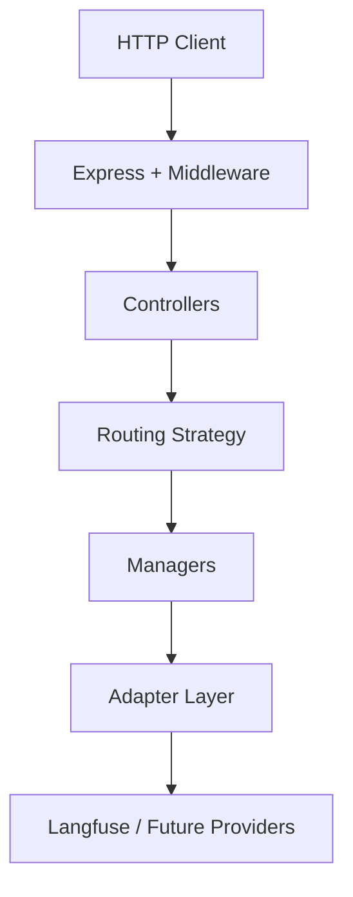
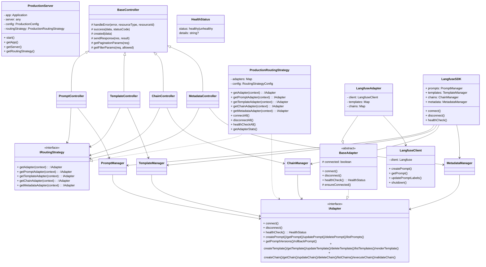
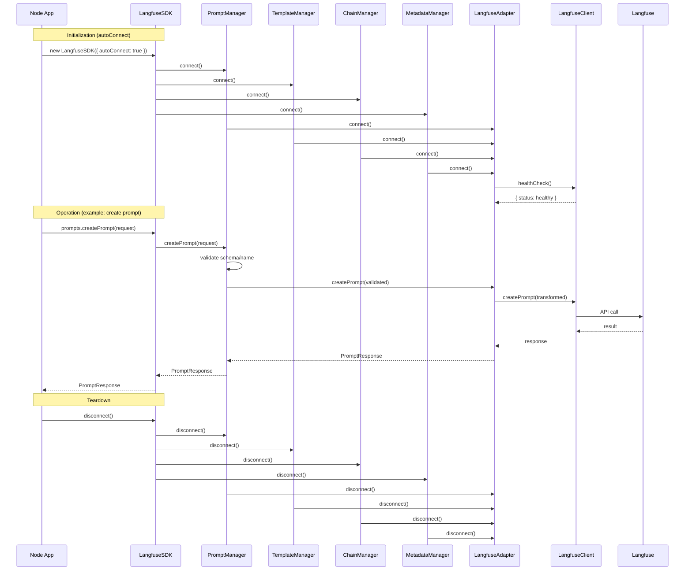

# Langfuse Adaptor Architecture

## Overview

The Langfuse Adaptor has been refactored to implement a **Controller Pattern with Routing Strategy** architecture that follows the sequence diagram specifications. This architecture provides a clean separation of concerns, production-ready features, and extensibility for future adapters.

## Architecture Components

### 🏗️ **Core Architecture Pattern**

```
HTTP Request
    ↓
Express Server + Middleware
    ↓
Controller Layer (PromptController, TemplateController, etc.)
    ↓
Routing Strategy (determines which adapter to use)
    ↓
Manager Layer (PromptManager, TemplateManager, etc.)
    ↓
Adapter Layer (LangfuseAdapter, future: OpenAIAdapter, etc.)
    ↓
External Service (Langfuse, OpenAI, etc.)
```

### 📁 **Directory Structure**

```
src/
├── api/                          # REST API Layer
│   ├── controllers/              # 🆕 Controller Pattern Implementation
│   │   ├── base-controller.ts    # Common controller functionality
│   │   ├── prompt-controller.ts  # Prompt HTTP request handling
│   │   ├── template-controller.ts
│   │   ├── chain-controller.ts
│   │   └── metadata-controller.ts
│   ├── strategies/               # 🆕 Routing Strategy Pattern
│   │   └── routing-strategy.ts   # Intelligent adapter selection
│   ├── routes/                   # Route definitions using controllers
│   │   ├── prompt-routes.ts
│   │   ├── template-routes.ts
│   │   ├── chain-routes.ts
│   │   └── metadata-routes.ts
│   ├── middleware/               # Express middleware
│   │   ├── error-handler.ts
│   │   └── validation.ts
│   └── server.ts                 # 🆕 Production-ready Express server
├── sdk/                          # Node.js SDK Layer
│   ├── prompt-manager.ts         # Business logic for prompts
│   ├── template-manager.ts       # Business logic for templates
│   ├── chain-manager.ts          # Business logic for chains
│   ├── metadata-manager.ts       # Business logic for metadata
│   └── index.ts                  # 🆕 Unified SDK + Factory functions
├── adapters/                     # Adapter Pattern Implementation
│   ├── base-adapter.ts           # Adapter interface
│   └── langfuse/
│       ├── langfuse-adapter.ts   # Langfuse implementation
│       └── langfuse-client.ts
├── config/                       # Configuration Management
│   ├── langfuse.ts
│   └── production.ts             # 🆕 Production configuration
├── utils/                        # Utilities
│   ├── logger.ts                 # 🆕 Structured logging
│   ├── template-engine.ts
│   ├── validation.ts
│   └── versioning.ts
└── types/                        # TypeScript type definitions
    ├── prompt.ts
    ├── template.ts
    ├── chain.ts
    └── common.ts
```

## 🔄 **Request Flow (Sequence Diagram Implementation)**

### REST API Flow
```
1. HTTP Client → Express Server
2. Express Server → UnifiedAuthMiddleware (security, validation)
3. Express Server → PromptController.createPrompt()
4. PromptController → RoutingStrategy.getPromptAdapter(context)
5. RoutingStrategy → Returns LangfuseAdapter (based on context)
6. PromptController → PromptManager.createPrompt()
7. PromptManager → LangfuseAdapter.createPrompt()
8. LangfuseAdapter → Langfuse SDK
9. Response flows back through the chain
```

### SDK Flow
```
1. Node.js App → LangfuseSDK.prompts.createPrompt()
2. LangfuseSDK → PromptManager.createPrompt()
3. PromptManager → LangfuseAdapter.createPrompt()
4. LangfuseAdapter → Langfuse SDK
5. Response flows back through the chain
```

## 🎯 **Key Features**

### 1. **Controller Pattern**
- **BaseController**: Common functionality (error handling, response formatting)
- **Specific Controllers**: Handle HTTP requests for each resource type
- **Context Extraction**: Extract routing context from headers (user, org, environment)

### 2. **Routing Strategy Pattern**
- **IRoutingStrategy**: Interface for adapter selection logic
- **ProductionRoutingStrategy**: Current implementation (Langfuse only)
- **Context-Aware**: Routes based on user, organization, environment, region
- **Future-Ready**: Easy to extend for multiple adapters

### 3. **Production Features**
- **Structured Logging**: JSON/text logging with request tracking
- **Configuration Management**: Environment-based config with validation
- **Health Monitoring**: Automated health checks and monitoring
- **Security**: Rate limiting, CORS, Helmet, input validation
- **Error Handling**: Comprehensive error tracking and reporting
- **Graceful Shutdown**: Proper cleanup on server termination

### 4. **Unified SDK**
- **LangfuseSDK**: Single entry point for all operations
- **Factory Functions**: `createPromptManager()`, `createTemplateManager()`, etc.
- **Manager Access**: Direct access to individual managers
- **Backward Compatibility**: Works with existing code

## 🚀 **Usage Examples**

### REST API Usage
```bash
# Start production server
npm run dev

# API endpoints
GET    /api/v1/prompts
POST   /api/v1/prompts
GET    /api/v1/prompts/:id
PUT    /api/v1/prompts/:id
DELETE /api/v1/prompts/:id

# With context headers
curl -X POST /api/v1/prompts \
  -H "Content-Type: application/json" \
  -H "X-User-ID: user123" \
  -H "X-Organization-ID: org456" \
  -H "X-Environment: production" \
  -d '{"name": "greeting", "content": "Hello {{name}}!"}'
```

### SDK Usage

#### Option 1: Unified SDK (Recommended)
```typescript
import { LangfuseSDK } from 'langfuse-adaptor';

const sdk = new LangfuseSDK({ autoConnect: true });

// Use different managers
await sdk.prompts.createPrompt({ name: 'test', content: 'Hello {{name}}' });
await sdk.templates.renderTemplate({ templateId: 'id', variables: { name: 'Alice' } });
await sdk.chains.executeChain({ chainId: 'id', initialData: {} });

// Unified operations
await sdk.connect();
await sdk.disconnect();
const health = await sdk.healthCheck();
```

#### Option 2: Individual Managers
```typescript
import { createPromptManager, createTemplateManager } from 'langfuse-adaptor';

const promptManager = createPromptManager({ autoConnect: true });
const templateManager = createTemplateManager({ autoConnect: true });

await promptManager.createPrompt({ name: 'test', content: 'Hello {{name}}' });
await templateManager.renderTemplate({ templateId: 'id', variables: { name: 'Alice' } });
```

#### Option 3: Factory Function
```typescript
import { createManagers } from 'langfuse-adaptor';

const { prompts, templates, chains, metadata } = createManagers({ autoConnect: true });

await prompts.createPrompt({ name: 'test', content: 'Hello {{name}}' });
await templates.renderTemplate({ templateId: 'id', variables: { name: 'Alice' } });
```

## 🔧 **Configuration**

### Environment Variables
```bash
# Required
LANGFUSE_BASE_URL=http://localhost:3000
LANGFUSE_PUBLIC_KEY=your_public_key
LANGFUSE_SECRET_KEY=your_secret_key

# Optional Production Settings
NODE_ENV=production
LOG_LEVEL=warn
LOG_FORMAT=json
ENABLE_RATE_LIMIT=true
ENABLE_HEALTH_CHECKS=true
ENABLE_REQUEST_LOGGING=true
CORS_ORIGIN=https://yourdomain.com
PORT=8080
```

### Programmatic Configuration
```typescript
import { createProductionConfig, ProductionServer } from 'langfuse-adaptor';

const config = createProductionConfig();
const server = new ProductionServer();
await server.start();
```

## 🎯 **Benefits Achieved**

1. **✅ Follows Sequence Diagram**: Exact architecture implementation
2. **✅ Production Ready**: Comprehensive logging, monitoring, security
3. **✅ Scalable**: Easy to add new adapters (OpenAI, Anthropic, etc.)
4. **✅ Context-Aware**: Intelligent routing based on request context
5. **✅ Type Safe**: Full TypeScript implementation with proper types
6. **✅ Maintainable**: Clean separation of concerns
7. **✅ Observable**: Structured logging and health monitoring
8. **✅ Secure**: Rate limiting, CORS, input validation, error handling
9. **✅ Resilient**: Graceful shutdown, connection management
10. **✅ Flexible**: Multiple usage patterns (SDK, REST API, individual managers)

## 🔮 **Future Extensions**

The architecture is designed for easy extension:

### Adding New Adapters
```typescript
// 1. Implement the adapter
class OpenAIAdapter implements IAdapter {
  // Implementation
}

// 2. Update routing strategy
const routingStrategy = new ProductionRoutingStrategy({
  defaultAdapter: 'langfuse',
  langfuseConfig: {...},
  openaiConfig: {...},      // 🆕 New adapter config
});

// 3. Intelligent routing
routingStrategy.getAdapter({
  userId: 'user123',
  organizationId: 'org456', 
  environment: 'production',
  // Strategy can route to best adapter based on context
});
```

### Adding New Controllers
```typescript
class CustomController extends BaseController {
  constructor(private routingStrategy: IRoutingStrategy) {
    super();
  }
  
  async customOperation(req: Request, res: Response): Promise<void> {
    // Implementation using routing strategy
  }
}
```

## 📊 **Monitoring & Observability**

### Health Checks
```bash
GET /health
{
  "status": "healthy",
  "adapters": {
    "langfuse": { "status": "healthy" }
  },
  "timestamp": "2024-01-01T00:00:00.000Z"
}
```

### Structured Logging
```json
{
  "timestamp": "2024-01-01T00:00:00.000Z",
  "level": "INFO",
  "service": "langfuse-adaptor",
  "message": "POST /api/v1/prompts 201 45ms",
  "type": "request",
  "method": "POST",
  "url": "/api/v1/prompts",
  "statusCode": 201,
  "responseTime": 45,
  "userId": "user123",
  "organizationId": "org456"
}
```

## 🎉 **Summary**

The refactored Langfuse Adaptor now implements a production-ready, enterprise-grade architecture that:

- **Follows the sequence diagram exactly**
- **Provides multiple usage patterns** (REST API, SDK, individual managers)
- **Includes comprehensive production features** (logging, monitoring, security)
- **Supports future extensibility** (multiple adapters, intelligent routing)
- **Maintains backward compatibility** while providing a cleaner API

The system is ready for production deployment and can scale to support multiple AI providers and complex routing scenarios.

---

## Detailed Architecture Specification (Canonical)

The following section consolidates the previously separate ARCHITECTURE-SPEC.md into this single document. If any details in the overview conflict with this section, this section is the source of truth.

### 1. Purpose and Scope

- **Purpose**: Define the reference architecture, module boundaries, class responsibilities, and public contracts of the Langfuse Adaptor. This document serves engineers building features, extending adapters, or integrating via SDK/REST.
- **Scope**: Runtime architecture, key classes/interfaces, request/response flows, non-functional requirements, and extensibility guidelines.

### 2. High-Level Overview

- **Pattern**: Controller Pattern with Routing Strategy and Adapter abstraction.
- **Layers**: HTTP API → Controllers → Routing Strategy → Managers (SDK) → Adapter(s) → External Service(s).



### 3. Architectural Drivers

- **Separation of concerns**: Controllers handle HTTP; managers handle business rules; adapters encapsulate provider specifics.
- **Extensibility**: Plug-and-play adapters; strategy-based routing; type-safe SDK.
- **Production readiness**: Logging, validation, error handling, health checks, graceful shutdown, CORS/Helmet, rate limiting.
- **Consistency**: Strong TypeScript types; unified request/response shapes; versioning utilities.

### 4. Component Model and Responsibilities

#### 4.1 Server and API Layer

- `src/api/server.ts` → `ProductionServer`
  - Responsibilities
    - Create and configure Express app and middleware
    - Initialize `ProductionRoutingStrategy`
    - Mount resource routes (`/prompts`, `/templates`, `/chains`, `/metadata`)
    - Provide `/health` and root metadata endpoints
    - Manage lifecycle: connect adapters, start/stop HTTP server, graceful shutdown, health monitoring
  - Key public methods
    - `start(): Promise<void>`
    - `getApp(): express.Application`
    - `getServer(): any`
    - `getRoutingStrategy(): ProductionRoutingStrategy`

#### 4.2 Controllers (HTTP)

- Base class: `src/api/controllers/base-controller.ts` → `BaseController`
  - Common utilities: `handleError`, `success`, `created`, `sendResponse`, `getPaginationParams`, `getFilterParams`

- Resource controllers
  - `PromptController`
    - Endpoints: create, get, getVersion, update, list, versions, rollback, delete, search, validate, health
    - Collaborators: `IRoutingStrategy`, `PromptManager`
  - `TemplateController`
    - Endpoints: create, get, update, list, render, delete, search, validate, versions, health
    - Collaborators: `IRoutingStrategy`, `TemplateManager`
  - `ChainController`
    - Endpoints: create, get, update, list, execute, delete, search, validate, versions, executions, health
    - Collaborators: `IRoutingStrategy`, `ChainManager`
  - `MetadataController`
    - Endpoints: stats, resources, search, activity, duplicates, orphaned, system, validation, global search, export, tag/author analytics, health
    - Collaborators: `IRoutingStrategy`, `MetadataManager`, `PromptManager`, `TemplateManager`, `ChainManager`

Controllers extract a `RoutingContext` from headers and delegate to the appropriate manager via the routing strategy.

#### 4.3 Routing Strategy

- `src/api/strategies/routing-strategy.ts`
  - Interfaces: `IRoutingStrategy`, `RoutingContext`, `RoutingStrategyConfig`
  - Implementation: `ProductionRoutingStrategy`
    - Manages adapter instances (Map)
    - Decides adapter per request (`getAdapter`, typed helpers)
    - Lifecycle: `connectAll`, `disconnectAll`
    - Health: `healthCheckAll`, `getAdapterStats`
  - Extensible to multiple providers (OpenAI/Anthropic/etc.) and context-aware routing

#### 4.4 SDK Managers (Business Logic)

- Location: `src/sdk/*`
- Purpose: Validate inputs, coordinate adapter calls, add business rules and utilities.
  - `PromptManager`
    - Methods: `connect`, `disconnect`, `healthCheck`, `createPrompt`, `getPrompt`, `getPromptVersion`, `updatePrompt`, `deletePrompt`, `listPrompts`, `getPromptVersions`, `rollbackPrompt`, `getLatestPrompt`, `comparePromptVersions`, `searchPrompts`, `validatePrompt`, `getPromptStats`
  - `TemplateManager`
    - Methods: `connect`, `disconnect`, `healthCheck`, `createTemplate`, `getTemplate`, `updateTemplate`, `deleteTemplate`, `listTemplates`, `renderTemplate`, `renderTemplateWithEngine`, `validateTemplate`, `previewTemplate`, `getTemplateVariables`, `searchTemplates`, `cloneTemplate`, `getTemplateStats`
  - `ChainManager`
    - Methods: `connect`, `disconnect`, `healthCheck`, `createChain`, `getChain`, `updateChain`, `deleteChain`, `listChains`, `executeChain`, `validateChain`, `getChainDependencies`, `cloneChain`, `getChainExecutionPlan`, `searchChains`
  - `MetadataManager`
    - Methods: `connect`, `disconnect`, `healthCheck`, `getOverallStats`, `getAllResourceMetadata`, `getResourcesByTag`, `getResourcesByAuthor`, `getTagAnalysis`, `getAllTagsAnalysis`, `getAuthorAnalysis`, `getAllAuthorsAnalysis`, `searchResources`, `getRecentActivity`, `getResourceDuplicates`, `getUnusedTags`, `getOrphanedResources`, `exportMetadata`
  - Unified entrypoint: `LangfuseSDK` exposes `prompts`, `templates`, `chains`, `metadata` and lifecycle methods.

#### 4.5 Adapter Layer

- `src/adapters/base-adapter.ts`
  - Interfaces: `IPromptAdapter`, `ITemplateAdapter`, `IChainAdapter`, `IAdapter`
  - Abstract: `BaseAdapter` (enforces connection state; declares all operations)

- `src/adapters/langfuse/langfuse-adapter.ts` → `LangfuseAdapter`
  - Implements `IAdapter`; composes `LangfuseClient`
  - Prompt operations via Langfuse API
  - Template/Chain operations implemented in-memory for now
  - Adds helpers: variable extraction, substitution, versioning via semver

- `src/adapters/langfuse/langfuse-client.ts` → `LangfuseClient`
  - Thin client around `langfuse` SDK; provides prompt operations, health, and shutdown

#### 4.6 Types and Data Contracts

- Location: `src/types/*`
  - `prompt.ts`, `template.ts`, `chain.ts`, `common.ts` (see file for details)

#### 4.7 Middleware

- `src/api/middleware/error-handler.ts` and `src/api/middleware/validation.ts`

#### 4.8 Routes

- `src/api/routes/*-routes.ts` registers endpoints for prompts, templates, chains, metadata.

#### 4.9 Configuration and Logging

- `src/config/production.ts` and `src/utils/logger.ts`

### 5. Class Diagram



### 6. Runtime Flows

#### 6.1 REST API (example: Create Prompt)

1) HTTP POST `/api/v1/prompts` → Express middleware (CORS/Helmet/validation/rate-limit)
2) `PromptController.createPrompt()`
3) Extract `RoutingContext` (headers)
4) `ProductionRoutingStrategy.getPromptAdapter(context)`
5) `PromptManager.createPrompt()` (validation + adapter call)
6) `LangfuseAdapter.createPrompt()` → `LangfuseClient.createPrompt()`
7) Response → `BaseController.created()` → JSON

#### 6.2 SDK (example: Use unified SDK)

1) `new LangfuseSDK({ autoConnect: true })`
2) `sdk.prompts.createPrompt()` → `PromptManager.createPrompt()`
3) Adapter call via `LangfuseAdapter`
4) Return typed `PromptResponse`

#### 6.3 SDK Flow (Node app)



### 7. Public Contracts (Selected)

- `IRoutingStrategy`
  - `getAdapter(context?: RoutingContext): IAdapter`
  - `getPromptAdapter/getTemplateAdapter/getChainAdapter/getMetadataAdapter`
  - `connectAll(): Promise<void>` / `disconnectAll(): Promise<void>`
  - `healthCheckAll(): Promise<Record<string, { status: 'healthy' | 'unhealthy'; details?: string }>>`

- `IAdapter`
  - Prompt: `createPrompt`, `getPrompt`, `updatePrompt`, `deletePrompt`, `listPrompts`, `getPromptVersions`, `rollbackPrompt`
  - Template: `createTemplate`, `getTemplate`, `updateTemplate`, `deleteTemplate`, `listTemplates`, `renderTemplate`
  - Chain: `createChain`, `getChain`, `updateChain`, `deleteChain`, `listChains`, `executeChain`, `validateChain`
  - Lifecycle/Health: `connect`, `disconnect`, `healthCheck`

- Managers expose analogous methods with additional validation, versioning, and convenience operations.

### 8. Error Handling

- Centralized error middleware converts exceptions to `ApiResponse<null>` with `code` and `message`.
- Known error types map to HTTP status codes (400/401/403/404/409/500).
- Global process handlers terminate on uncaught exceptions/unhandled rejections (with logs).

### 9. Validation

- Input schemas via Joi at route boundary.
- Manager-level validation (schema utilities, name/version rules, template syntax/variables, chain step and data mapping validation).

### 10. Observability & Health

- Structured logging (JSON or text) with request IDs and timing.
- Health endpoints: `/health`, per-resource `/health/check`.
- Background health monitoring with interval checks (configurable).

### 11. Security

- Helmet, CORS configuration, request size limits, rate limiting.
- API key validation helper (disabled by default; placeholder for future).

### 12. Configuration

- `ProductionConfig` built from environment variables; validated at startup.
- Key env: `LANGFUSE_BASE_URL`, `LANGFUSE_PUBLIC_KEY`, `LANGFUSE_SECRET_KEY`, `PORT`, `LOG_LEVEL`, `ENABLE_*` flags.

### 13. Versioning

- Prompts: semantic version string derived from Langfuse numeric versions; labels (`latest`, `production`) supported.
- Templates/Chains: semver bump on updates in in-memory implementation (until external backing added).

### 14. Extensibility Guidelines

- Adding a new adapter
  1) Implement `IAdapter` (extend `BaseAdapter`)
  2) Register in `ProductionRoutingStrategy.initializeAdapters()`
  3) Extend `RoutingStrategyConfig` for adapter config
  4) Optionally add context-aware routing rules

- Adding a new controller/resource
  1) Extend `BaseController`
  2) Create manager for business logic
  3) Define types and validation schemas
  4) Add routes with middleware

### 15. Non-Functional Requirements

- **Performance**: Middleware ordering optimized; pagination and filtering supported across listings.
- **Reliability**: Health checks, graceful shutdown, adapter lifecycle management.
- **Maintainability**: Strong typing, clear boundaries, shared helpers/utilities.
- **Security**: Sensible defaults (Helmet/CORS), rate limiting, size limits.

### 16. API Surface (HTTP)

- Base path: `/api/v1`
- Prompts: `GET /prompts`, `POST /prompts`, `GET /prompts/:id`, `PUT /prompts/:id`, `DELETE /prompts/:id`, `GET /prompts/:id/versions`, `GET /prompts/:id/versions/:version`, `POST /prompts/:id/rollback`, `POST /prompts/search`, `POST /prompts/:id/validate`, `GET /prompts/health/check`
- Templates: `GET /templates`, `POST /templates`, `GET /templates/:id`, `PUT /templates/:id`, `DELETE /templates/:id`, `POST /templates/:id/render`, `POST /templates/search`, `POST /templates/:id/validate`, `GET /templates/:id/versions`, `GET /templates/health/check`
- Chains: `GET /chains`, `POST /chains`, `GET /chains/:id`, `PUT /chains/:id`, `DELETE /chains/:id`, `POST /chains/:id/execute`, `POST /chains/search`, `POST /chains/:id/validate`, `GET /chains/:id/versions`, `GET /chains/:id/executions`, `GET /chains/health/check`
- Metadata: `GET /metadata/stats`, `GET /metadata/resources`, `POST /metadata/search`, `GET /metadata/activity`, `GET /metadata/duplicates`, `GET /metadata/orphaned`, `GET /metadata/system`, `GET /metadata/validation`, `POST /metadata/search/global`, `GET /metadata/export/all`, `GET /metadata/tags/analysis`, `GET /metadata/authors/stats`, `GET /metadata/health/check`

### 17. Known Limitations and Roadmap

- `LangfuseClient.getPrompts/getPromptVersions` are simulated until native SDK endpoints exist.
- Templates/Chains are in-memory within `LangfuseAdapter` pending backing storage/provider.
- Routing Strategy currently returns Langfuse always; future: org/env/region-aware routing and multi-provider support.

### 18. Glossary

- Adapter: Provider-specific implementation (Langfuse today; others future).
- Manager: Business logic orchestrator used by controllers and SDK consumers.
- Routing Strategy: Component deciding which adapter instance to use per request/context.
